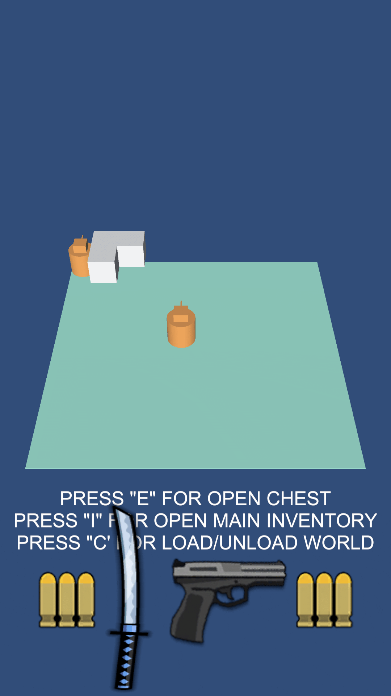
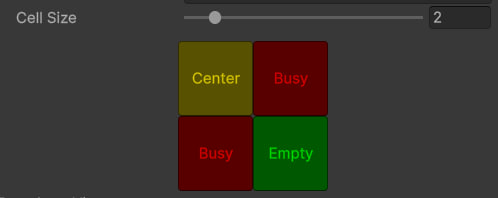
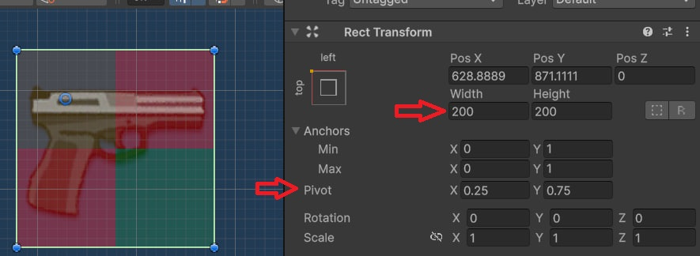
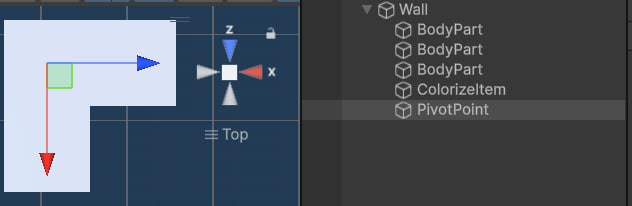

# "Grid System (2D/3D) by at0m"
#### In process

### Description
- A small plugin for Unity that allows you to implement an inventory or any other system that requires a grid and the placement of irregularly shaped objects.
- Technology stack: Zenject, UniRx, UniTask, DOTween (optional, but recommended).

### Unity versions
- Latest release requires Unity 6  or higher.

#### Advantage
- Support for 2D and 3D spaces.
- Support for complex shapes.
- Support for complex shapes.
- The ability to expand and customize solutions.

#### Disadvantages
- Currently, it is completely dependent on Zenject.
- There is no support for the corresponding system. Currently, it is not possible to move an element from 3D to 2D and from 2D to 3D. However, this can be implemented.

#### Road Map
- Add support for VContainer.
- Add the ability to expand the Grid.
- The ability to move elements from 3D to 2D and from 2D to 3D.

### Download

### Demo

# ❓ FAQ

<b>How do I create a new entity?</b>

 Create/Inventory/Select the desired data

<b>How do I set up ItemData?</b>

1) Create data in the "Create/Inventory/ItemData" path. 
2) In the created ItemData, configure Rows and Columns as if your item were rectangular. 
3) CellSize is designed for convenience and allows you to customize the visual size. 
The location of an element in the table is configured by configuring the position matrix in EditorGrid. 
Since our matrix is rectangular, complex objects will have empty cells in addition to the center and occupied cells. This is normal and intended. 

4) Next, configure the pivot and dimensions of the object. Also, arrange the element as it is in the EditorGrid. 

 
5) For 3D objects, you will need to create a child Transform to implement pivot. 

 
6) Next, you need to add your ItemData to InventoryConfig. For 2D and 3D items, they are different, so be careful.

<b>How do I create a new Grid?</b>

 
1) Create an InventoryConfig and configure its dimensions and cell prefab. 
2) Now you need to add your new Grid to InventoriesConfig and assign it the desired type.

